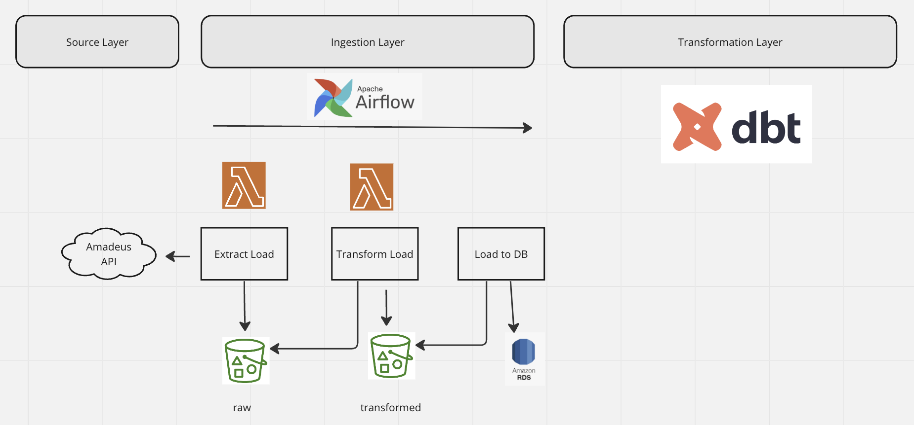

# Flights Data Pipeline

## About

Flights data pipeline retrieves and stores flights data to track prices.  Currently, pipeline only stores and transforms the data -- but was designed with various use cases in mind.

* Ticket price prediction - Flight data can be predict pricing of different flights -- reverse engineering a sort of flightcaster to predict when someone should buy their ticket. 

* Searching - End users can search based on a location, or choose routes based on price, or those that are the most below the normal price.

* Alerting - The pipeline can be used to alert when there is a good deal on a specific flight -- or to send an alert when flights are below a specific price.

### Usage

We use serverless to deploy dockerized lambda functions, an rds instance and grant access to an S3 bucket.  For the below steps to work, docker should be installed and runing.

1. Install serverless
```bash
brew install node
npm install serverless
```

2. Customize the data pipeline
The pipeline relies on the amadeus api.  Register for API keys, and then update the credentials in the `codebase/extract_load/.env` file.  You will also need an S3 bucket associated with your aws account.  Specify this in the `codebase/extract_load/.env` file as well as the `transform_load/.env` file.  Finally in the project directory's .env file, specify a rds service name, database name, and database password. 

You can also create an S3 bucket and specify the `bucket_name` in the `transform_load` and `extract_load` `.env` files. 

3. Deploy AWS services
Serverless relies on AWS user credentials being set in the ~./aws directory.  You can check if your credentials are there by running the following.

```bash
cat ~/.aws/credentials
```
The credentials should be for a user that either has admin access or has access to full access for s3, lambda, ecr, and rds services.  We need to invoke dotenv so that the environmental variables specified in the .env file are accessible by our `serverless.yml` file.

Install python-dotenv if it is not already installed.

```bash
pip install python-dotenv
```

Run the `setup.py` file to declare the environmental variables in your environment.

```bash
python3 setup.py
```

With that access, and with docker up and running, you can deploy the aws services.

```bash
sls deploy
```

Initialize the database.  After the RDS instance is available, we can create a new database and table.  Run the function in the `load_to_postgres/setup_db.py`.  The `create_database` function will start with the default postgres database and create a new database defined in the `.env` file.  And then we can run the `create_table` function to create a `flights` table that we will load our s3 data to. 

4. Kick off pipeline with airflow

From here, you can boot up airflow locally.  Because we are using airflow to access and invoke our AWS services, we also need our AWS credentials available there.  In the docker compose file, we bind mount our ~./aws directory to our airflow environment.

Run the following to bootup airflow.

```bash
docker compose up
```

And from there, you can kick off our data pipeline.  For information on how to deploy airflow to a separate EC2 instance, you can view the [following video](https://www.youtube.com/watch?v=o88LNQDH2uI&ab_channel=DatawithMarc) for reference.

### Architecture

The application consists of three separate services -- (1) extracting and loading to s3, (2) transformation to s3 (3) and loading to postgres.  Scheduling and orchestration is performed through airflow, with the first two services dockerized and deployed as lambda functions.



### Architecture Considerations

* EL - TL approach
We designed the pipeline using an EL-TL pipeline.  By storing both the raw data, and then transforming that raw data for consumption by a data warehouse, we effectively have a lakehouse.  Data scientists/engineers can access the raw data, as needed. Data analysts can use SQL to query the data warehouse.

* Use of Lambda, Airflow, Docker
We rely on aws lambda to ease deployment and upkeep of each service, while only paying per lambda invocation. Meanwhile, we use airflow for orchestration and for monitoring.  By having airflow principally invoke lambda functions, we minimize it's responsibilities -- simplifying upkeep and deployment.  Because each of our services are dockerized, we have a low switching cost to other cloud providers (if we decide to deploy with GCS), or orchestration providers (if we want to move to prefect, our airflow code is very slim). 

* Configurability/Microservices - We wanted to treat the first extract and loading (EL) as a separate service from the transform and load.  We did this because the EL service itself provides user value -- providing for our data lake.  Whereas our TL serves is a separate service for our data warehouse.  By making the EL layer in particular a separate service (and hosting with lambda), we can retrieve and store data as needed by sending events to the our lambda, without triggering the rest of the pipeline.

